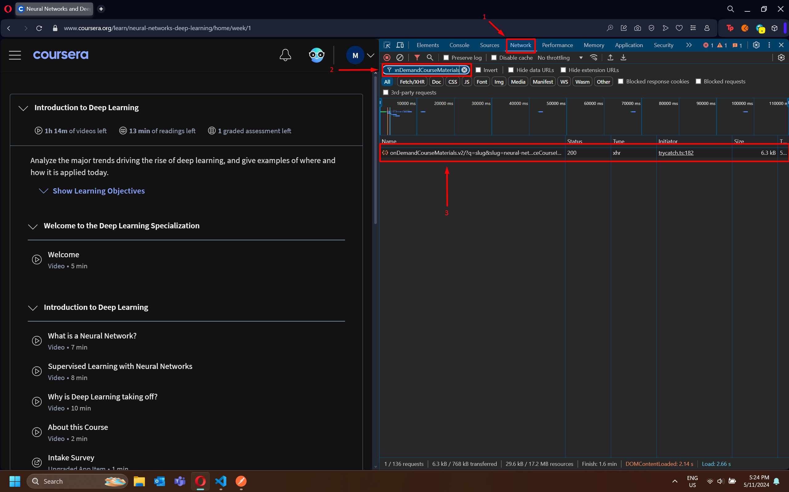

## Folder and subfolder creation

## Brief description
Script able to create folders and subfolders based on a json file taken from a specific course on Coursera platform

## How to get this necessary json file (Not working anymore !!!)
This json file needs to be pulled from Coursera's website once logged in the course:
- Go to the main menu for the course
- Right click in an empty space on the website and then select "Page source"
- Look for *window.App={*
    - Copy the entire line and paste it in a code editor
- Remove *window.App={* and the last character ( ";" ). Save the file. Name it *course1.json*, for example
- Run python script
- Your folder(s) should be created

> Note 1: Inside main.py file there is a list of files to be processed: Their filenames are *course1.json* and *course2.json*. Change them as needed

> Note 2: Each folder and subfolder contains a README.md file in order to be able to upload the entire structure to GitHub

## Example
An execution example is provided. See [output_example.txt](https://github.com/mvarrone/coursera-scripts/blob/master/1-create-folder-structure-for-course/output_example.txt) for more information

## Please, read the following text

> [!NOTE]
> Things had changed in order to get this *json* file. The problem is that using the method described above can get a certain data but not the full data as before (used for courses 1 and 2). 
> 
> It seems like from the backend now it is returned less information that can be captured using the Inspect Source page method. But there is already a solution! Check below

> [!IMPORTANT]
> Now, instead you can use this URL (obtained by inspecting the **Network tab** inside the "Inspect element" option)
>
> Use Postman, for example, to send a GET request with the following URL for this Course 3 on this Machine Learning Specializacion on Coursera's platform
> 
> GET 
> https://www.coursera.org/api/onDemandCourseMaterials.v2/?q=slug&slug=machine-learning-projects&includes=modules%2Clessons%2CpassableItemGroups%2CpassableItemGroupChoices%2CpassableLessonElements%2Citems%2Ctracks%2CgradePolicy%2CgradingParameters%2CembeddedContentMapping&fields=moduleIds%2ConDemandCourseMaterialModules.v1(name%2Cslug%2Cdescription%2CtimeCommitment%2ClessonIds%2Coptional%2ClearningObjectives)%2ConDemandCourseMaterialLessons.v1(name%2Cslug%2CtimeCommitment%2CelementIds%2Coptional%2CtrackId)%2ConDemandCourseMaterialPassableItemGroups.v1(requiredPassedCount%2CpassableItemGroupChoiceIds%2CtrackId)%2ConDemandCourseMaterialPassableItemGroupChoices.v1(name%2Cdescription%2CitemIds)%2ConDemandCourseMaterialPassableLessonElements.v1(gradingWeight%2CisRequiredForPassing)%2ConDemandCourseMaterialItems.v2(name%2CoriginalName%2Cslug%2CtimeCommitment%2CcontentSummary%2CisLocked%2ClockableByItem%2CitemLockedReasonCode%2CtrackId%2ClockedStatus%2CitemLockSummary)%2ConDemandCourseMaterialTracks.v1(passablesCount)%2ConDemandGradingParameters.v1(gradedAssignmentGroups)%2CcontentAtomRelations.v1(embeddedContentSourceCourseId%2CsubContainerId)&showLockedItems=true
>
> After copy and paste it in Postman, send the request and copy the response in a file called *course3.json*. After that, execute the *main.py* file and you will see a new folder created with subfolders, README.md files in each folder/subfolder and inside each one of them some content created.
>
> That content will be the title of every video in the specialiation.
>

## Image to show what to look for

### Steps:

0. Right click on the page and select **Inspect element"** (This step is not shown on the screenshot)
1. Select the **Network** tab (Shown with a number 1)
2. Filter using **onDemandCourseMaterials.v2** (Shown with a number 2)
3. Double click to the result obtained (Shown with a number 3). A new tab will be open
4. Copy the full URL
5. Paste it in Postman
